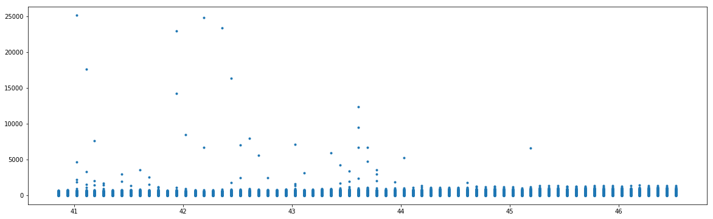
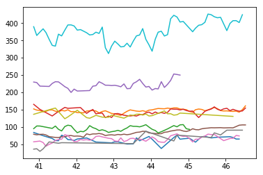

```python
# Dependencies
import sys
import os
import pandas as pd
import numpy as np
import matplotlib.pyplot as plt
import time
import datetime
```


```python
nb_loc = os.getcwd()
zecon_dataset_loc = os.path.join(nb_loc,'datasets','zecon')
datasets = os.listdir(zecon_dataset_loc)
template = pd.DataFrame({'name': [],
                        'contents' : []})
zdata = template
# for file in datasets:
#     tokens = file.split('.')
#     file_ext = tokens[-1]
#     if file_ext == 'json':
#         contents = pd.read_json(os.path.join(zecon_dataset_loc,file))
#     elif file_ext == 'csv':
#         contents = pd.read_csv(os.path.join(zecon_dataset_loc,file))
#     name = file
    # Need to create system to store each files data separately...
    
    
```


```python
city_time_series = pd.read_csv(os.path.join(zecon_dataset_loc,datasets[2]))
```


```python
sample = city_time_series[['Date','RegionName',
                      'PriceToRentRatio_AllHomes','MedianSoldPrice_AllHomes',
                     'MedianSoldPricePerSqft_AllHomes']].dropna(how='any')
```


```python
def str2unix(s):
    return time.mktime(datetime.datetime.strptime(s, "%Y-%m-%d").timetuple())
def convert_timescale(x):
    return x/(60*60*24*365)
```


```python
print(sample['Date'].head())
print(sample['Date'].tail())
```

    2346102    2010-10-31
    2346109    2010-10-31
    2346111    2010-10-31
    2346113    2010-10-31
    2346122    2010-10-31
    Name: Date, dtype: object
    3868199    2016-06-30
    3868204    2016-06-30
    3868209    2016-06-30
    3868220    2016-06-30
    3868222    2016-06-30
    Name: Date, dtype: object


```python
print(sample['Date'].head().apply(str2unix).apply(convert_timescale))
print(sample['Date'].tail().apply(str2unix).apply(convert_timescale))
```

    0    26.346005
    1    26.346005
    2    26.346005
    3    26.346005
    4    26.346005
    Name: Date, dtype: float64
    4172716    47.696689
    4172717    47.696689
    4172718    47.696689
    4172719    47.696689
    4172720    47.696689
    Name: Date, dtype: float64


```python
plt.figure(figsize=[20,6])
plt.plot(sample['Date'].apply(str2unix).apply(convert_timescale),sample['MedianSoldPricePerSqft_AllHomes'],'.')
plt.show()
```


    <matplotlib.figure.Figure at 0x14e254588>





```python
regions = sample['RegionName'].unique()
for region in regions[:10]:
    dates = sample.loc[sample['RegionName']==region,'Date'].apply(str2unix).apply(convert_timescale)
    price = sample.loc[sample['RegionName']==region,'MedianSoldPricePerSqft_AllHomes']
    plt.plot(dates,price)
# plt.ylim([0,500])
plt.show()
```





```python
regions[:5]

```


    array(['abbottstownadamspa', 'aberdeenharfordmd', 'aberdeenmonroems',
           'aberdeenmoorenc', 'abilenetaylortx'], dtype=object)


```python
city_time_series.keys()
```


    Index(['Date', 'RegionName', 'HomesSoldAsForeclosuresRatio_AllHomes',
           'InventorySeasonallyAdjusted_AllHomes', 'InventoryRaw_AllHomes',
           'MedianListingPricePerSqft_1Bedroom',
           'MedianListingPricePerSqft_2Bedroom',
           'MedianListingPricePerSqft_3Bedroom',
           'MedianListingPricePerSqft_4Bedroom',
           'MedianListingPricePerSqft_5BedroomOrMore',
           'MedianListingPricePerSqft_AllHomes',
           'MedianListingPricePerSqft_CondoCoop',
           'MedianListingPricePerSqft_DuplexTriplex',
           'MedianListingPricePerSqft_SingleFamilyResidence',
           'MedianListingPrice_1Bedroom', 'MedianListingPrice_2Bedroom',
           'MedianListingPrice_3Bedroom', 'MedianListingPrice_4Bedroom',
           'MedianListingPrice_5BedroomOrMore', 'MedianListingPrice_AllHomes',
           'MedianListingPrice_CondoCoop', 'MedianListingPrice_DuplexTriplex',
           'MedianListingPrice_SingleFamilyResidence',
           'MedianPctOfPriceReduction_AllHomes',
           'MedianPctOfPriceReduction_CondoCoop',
           'MedianPctOfPriceReduction_SingleFamilyResidence',
           'MedianPriceCutDollar_AllHomes', 'MedianPriceCutDollar_CondoCoop',
           'MedianPriceCutDollar_SingleFamilyResidence',
           'MedianRentalPricePerSqft_1Bedroom',
           'MedianRentalPricePerSqft_2Bedroom',
           'MedianRentalPricePerSqft_3Bedroom',
           'MedianRentalPricePerSqft_4Bedroom',
           'MedianRentalPricePerSqft_5BedroomOrMore',
           'MedianRentalPricePerSqft_AllHomes',
           'MedianRentalPricePerSqft_CondoCoop',
           'MedianRentalPricePerSqft_DuplexTriplex',
           'MedianRentalPricePerSqft_MultiFamilyResidence5PlusUnits',
           'MedianRentalPricePerSqft_SingleFamilyResidence',
           'MedianRentalPricePerSqft_Studio', 'MedianRentalPrice_1Bedroom',
           'MedianRentalPrice_2Bedroom', 'MedianRentalPrice_3Bedroom',
           'MedianRentalPrice_4Bedroom', 'MedianRentalPrice_5BedroomOrMore',
           'MedianRentalPrice_AllHomes', 'MedianRentalPrice_CondoCoop',
           'MedianRentalPrice_DuplexTriplex',
           'MedianRentalPrice_MultiFamilyResidence5PlusUnits',
           'MedianRentalPrice_SingleFamilyResidence', 'MedianRentalPrice_Studio',
           'MedianSoldPricePerSqft_AllHomes', 'MedianSoldPricePerSqft_CondoCoop',
           'MedianSoldPricePerSqft_SingleFamilyResidence',
           'MedianSoldPrice_AllHomes', 'ZHVIPerSqft_AllHomes',
           'PctOfHomesDecreasingInValues_AllHomes',
           'PctOfHomesIncreasingInValues_AllHomes',
           'PctOfHomesSellingForGain_AllHomes',
           'PctOfHomesSellingForLoss_AllHomes',
           'PctOfListingsWithPriceReductionsSeasAdj_AllHomes',
           'PctOfListingsWithPriceReductionsSeasAdj_CondoCoop',
           'PctOfListingsWithPriceReductionsSeasAdj_SingleFamilyResidence',
           'PctOfListingsWithPriceReductions_AllHomes',
           'PctOfListingsWithPriceReductions_CondoCoop',
           'PctOfListingsWithPriceReductions_SingleFamilyResidence',
           'PctTransactionsThatArePreviouslyForeclosuredHomes_AllHomes',
           'PriceToRentRatio_AllHomes', 'Turnover_AllHomes', 'ZHVI_1bedroom',
           'ZHVI_2bedroom', 'ZHVI_3bedroom', 'ZHVI_4bedroom',
           'ZHVI_5BedroomOrMore', 'ZHVI_AllHomes', 'ZHVI_BottomTier',
           'ZHVI_CondoCoop', 'ZHVI_MiddleTier', 'ZHVI_SingleFamilyResidence',
           'ZHVI_TopTier', 'ZRI_AllHomes', 'ZRI_AllHomesPlusMultifamily',
           'ZriPerSqft_AllHomes', 'Zri_MultiFamilyResidenceRental',
           'Zri_SingleFamilyResidenceRental'],
          dtype='object')


