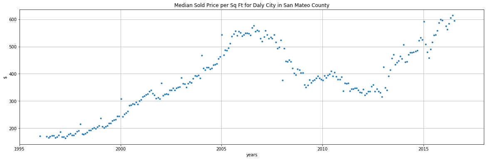
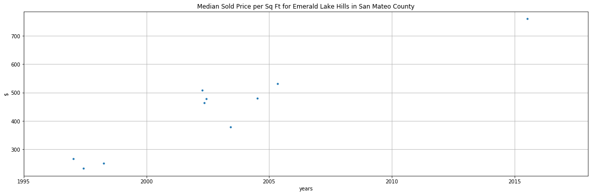
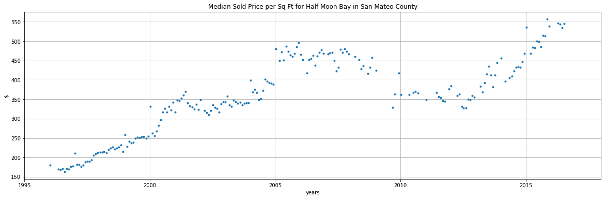
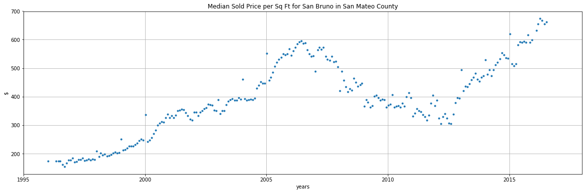

```python
# Dependencies
import sys
import os
import pandas as pd
import numpy as np
import matplotlib.pyplot as plt
import time
import datetime
```


```python
nb_loc = os.getcwd()
zecon_dataset_loc = os.path.join(nb_loc,'datasets','zecon')
datasets = os.listdir(zecon_dataset_loc)
template = pd.DataFrame({'name': [],
                        'contents' : []})
zdata = template
# for file in datasets:
#     tokens = file.split('.')
#     file_ext = tokens[-1]
#     if file_ext == 'json':
#         contents = pd.read_json(os.path.join(zecon_dataset_loc,file))
#     elif file_ext == 'csv':
#         contents = pd.read_csv(os.path.join(zecon_dataset_loc,file))
#     name = file
    # Need to create system to store each files data separately...
    
    
```


```python
crosswalk = pd.read_csv(os.path.join(zecon_dataset_loc,datasets[4]))
```


```python
city_time_series = pd.read_csv(os.path.join(zecon_dataset_loc,datasets[2]))
```


```python
combine = city_time_series.merge(crosswalk,right_on = 'Unique_City_ID', left_on = 'RegionName')
```


```python
combine.loc[combine['State']=='CA'].groupby(['County'])['RegionName'].count()
```


    County
    Alameda             4285
    Alpine               614
    Amador              2210
    Butte               3032
    Calaveras           2702
    Colusa              1095
    Contra Costa        7105
    Del Norte            682
    El Dorado           4277
    Fresno              7479
    Glenn                812
    Humboldt            4690
    Imperial            2643
    Inyo                1420
    Kern                7702
    Kings               1514
    Lake                2835
    Lassen              1994
    Los Angeles        29133
    Madera              1941
    Marin               5317
    Mariposa             895
    Mendocino           3488
    Merced              3216
    Modoc               1005
    Mono                1110
    Monterey            4662
    Napa                1529
    Nevada              1731
    Orange              9998
    Placer              5038
    Plumas              2302
    Riverside          11771
    Sacramento          5687
    San Benito           543
    San Bernardino     13697
    San Diego          10296
    San Francisco        257
    San Joaquin         5086
    San Luis Obispo     4736
    San Mateo           7084
    Santa Barbara       3515
    Santa Clara         6337
    Santa Cruz          2637
    Shasta              3657
    Sierra              1022
    Siskiyou            3310
    Solano              1841
    Sonoma              6035
    Stanislaus          3450
    Sutter              1496
    Tehama              1735
    Trinity             1938
    Tulare              5703
    Tuolumne            2688
    Ventura             4192
    Yolo                1539
    Yuba                1610
    Name: RegionName, dtype: int64


```python
county_of_interest = 'San Mateo'
combine.loc[combine['County']==county_of_interest].count()
```


    Date                                                             7084
    RegionName                                                       7084
    HomesSoldAsForeclosuresRatio_AllHomes                            2301
    InventorySeasonallyAdjusted_AllHomes                              460
    InventoryRaw_AllHomes                                             460
    MedianListingPricePerSqft_1Bedroom                                  0
    MedianListingPricePerSqft_2Bedroom                                 71
    MedianListingPricePerSqft_3Bedroom                                211
    MedianListingPricePerSqft_4Bedroom                                  0
    MedianListingPricePerSqft_5BedroomOrMore                            0
    MedianListingPricePerSqft_AllHomes                                768
    MedianListingPricePerSqft_CondoCoop                                92
    MedianListingPricePerSqft_DuplexTriplex                             0
    MedianListingPricePerSqft_SingleFamilyResidence                   609
    MedianListingPrice_1Bedroom                                         0
    MedianListingPrice_2Bedroom                                        68
    MedianListingPrice_3Bedroom                                       126
    MedianListingPrice_4Bedroom                                         0
    MedianListingPrice_5BedroomOrMore                                   0
    MedianListingPrice_AllHomes                                       369
    MedianListingPrice_CondoCoop                                       57
    MedianListingPrice_DuplexTriplex                                    0
    MedianListingPrice_SingleFamilyResidence                          292
    MedianPctOfPriceReduction_AllHomes                                  0
    MedianPctOfPriceReduction_CondoCoop                                 0
    MedianPctOfPriceReduction_SingleFamilyResidence                     0
    MedianPriceCutDollar_AllHomes                                       0
    MedianPriceCutDollar_CondoCoop                                      0
    MedianPriceCutDollar_SingleFamilyResidence                          0
    MedianRentalPricePerSqft_1Bedroom                                 118
                                                                     ... 
    PctOfHomesSellingForLoss_AllHomes                                   0
    PctOfListingsWithPriceReductionsSeasAdj_AllHomes                  252
    PctOfListingsWithPriceReductionsSeasAdj_CondoCoop                   0
    PctOfListingsWithPriceReductionsSeasAdj_SingleFamilyResidence      84
    PctOfListingsWithPriceReductions_AllHomes                         252
    PctOfListingsWithPriceReductions_CondoCoop                          0
    PctOfListingsWithPriceReductions_SingleFamilyResidence             84
    PctTransactionsThatArePreviouslyForeclosuredHomes_AllHomes       1808
    PriceToRentRatio_AllHomes                                        2158
    Turnover_AllHomes                                                6536
    ZHVI_1bedroom                                                    1354
    ZHVI_2bedroom                                                    5248
    ZHVI_3bedroom                                                    6218
    ZHVI_4bedroom                                                    4918
    ZHVI_5BedroomOrMore                                              4639
    ZHVI_AllHomes                                                    6306
    ZHVI_BottomTier                                                  6186
    ZHVI_CondoCoop                                                   3413
    ZHVI_MiddleTier                                                  6306
    ZHVI_SingleFamilyResidence                                       6306
    ZHVI_TopTier                                                     6052
    ZRI_AllHomes                                                     2050
    ZRI_AllHomesPlusMultifamily                                      2050
    ZriPerSqft_AllHomes                                              2050
    Zri_MultiFamilyResidenceRental                                   1230
    Zri_SingleFamilyResidenceRental                                  2050
    Unique_City_ID                                                   7084
    City                                                             7084
    County                                                           7084
    State                                                            7084
    Length: 89, dtype: int64


```python
col_of_interest = ['Date','City','County','State','RegionName',
                      'PriceToRentRatio_AllHomes','MedianSoldPrice_AllHomes',
                     'MedianSoldPricePerSqft_AllHomes']
sample = combine.loc[combine['County']=='San Mateo',col_of_interest]
# sample = city_time_series[col_of_interest].dropna(how='any')
```


```python
test_year = '1990'
convert_timescale(str2unix('%s-01-01' % test_year))%1+int(test_year)
```


    1990.0146118721461


```python
def str2unix(s):
    return time.mktime(datetime.datetime.strptime(s, "%Y-%m-%d").timetuple())
def convert_timescale(x):
    return x/(60*60*24*365)
def extract_year(x):
    return datetime.datetime.strptime(x, "%Y-%m-%d").timetuple().tm_year
def express_as_year(x):
    return convert_timescale(str2unix(x))%1+extract_year(x)
```


```python
plt.figure(figsize=[20,6])
plt.plot(sample['Date'].apply(express_as_year),sample['MedianSoldPricePerSqft_AllHomes'],'.')
plt.show()
```


```python
sample.max()
```


    Date                                        2017-08-31
    City                                          Woodside
    County                                       San Mateo
    State                                               CA
    RegionName                         woodsidesan_mateoca
    PriceToRentRatio_AllHomes                        30.88
    MedianSoldPrice_AllHomes                   1.01022e+07
    MedianSoldPricePerSqft_AllHomes                8468.93
    dtype: object


```python
regions = sample['City'].unique()
# plt.figure(figsize=[20,6])
for region in regions:
    plt.figure(figsize=[20,6])
    dates = sample.loc[sample['City']==region,'Date'].apply(express_as_year)
    price = sample.loc[sample['City']==region,'MedianSoldPricePerSqft_AllHomes']
    plt.plot(dates,price,'.')
    plt.title('Median Sold Price per Sq Ft for %s in %s County' % (region,county_of_interest))
    plt.grid(True)
    plt.ylabel('$')
    plt.xlabel('years')
    plt.xlim([1995,2018])
    plt.show()
# plt.title('%s regions in %s' % (len(regions),county_of_interest))

# plt.show()
```














```python
city_time_series.keys()
```


    Index(['Date', 'RegionName', 'HomesSoldAsForeclosuresRatio_AllHomes',
           'InventorySeasonallyAdjusted_AllHomes', 'InventoryRaw_AllHomes',
           'MedianListingPricePerSqft_1Bedroom',
           'MedianListingPricePerSqft_2Bedroom',
           'MedianListingPricePerSqft_3Bedroom',
           'MedianListingPricePerSqft_4Bedroom',
           'MedianListingPricePerSqft_5BedroomOrMore',
           'MedianListingPricePerSqft_AllHomes',
           'MedianListingPricePerSqft_CondoCoop',
           'MedianListingPricePerSqft_DuplexTriplex',
           'MedianListingPricePerSqft_SingleFamilyResidence',
           'MedianListingPrice_1Bedroom', 'MedianListingPrice_2Bedroom',
           'MedianListingPrice_3Bedroom', 'MedianListingPrice_4Bedroom',
           'MedianListingPrice_5BedroomOrMore', 'MedianListingPrice_AllHomes',
           'MedianListingPrice_CondoCoop', 'MedianListingPrice_DuplexTriplex',
           'MedianListingPrice_SingleFamilyResidence',
           'MedianPctOfPriceReduction_AllHomes',
           'MedianPctOfPriceReduction_CondoCoop',
           'MedianPctOfPriceReduction_SingleFamilyResidence',
           'MedianPriceCutDollar_AllHomes', 'MedianPriceCutDollar_CondoCoop',
           'MedianPriceCutDollar_SingleFamilyResidence',
           'MedianRentalPricePerSqft_1Bedroom',
           'MedianRentalPricePerSqft_2Bedroom',
           'MedianRentalPricePerSqft_3Bedroom',
           'MedianRentalPricePerSqft_4Bedroom',
           'MedianRentalPricePerSqft_5BedroomOrMore',
           'MedianRentalPricePerSqft_AllHomes',
           'MedianRentalPricePerSqft_CondoCoop',
           'MedianRentalPricePerSqft_DuplexTriplex',
           'MedianRentalPricePerSqft_MultiFamilyResidence5PlusUnits',
           'MedianRentalPricePerSqft_SingleFamilyResidence',
           'MedianRentalPricePerSqft_Studio', 'MedianRentalPrice_1Bedroom',
           'MedianRentalPrice_2Bedroom', 'MedianRentalPrice_3Bedroom',
           'MedianRentalPrice_4Bedroom', 'MedianRentalPrice_5BedroomOrMore',
           'MedianRentalPrice_AllHomes', 'MedianRentalPrice_CondoCoop',
           'MedianRentalPrice_DuplexTriplex',
           'MedianRentalPrice_MultiFamilyResidence5PlusUnits',
           'MedianRentalPrice_SingleFamilyResidence', 'MedianRentalPrice_Studio',
           'MedianSoldPricePerSqft_AllHomes', 'MedianSoldPricePerSqft_CondoCoop',
           'MedianSoldPricePerSqft_SingleFamilyResidence',
           'MedianSoldPrice_AllHomes', 'ZHVIPerSqft_AllHomes',
           'PctOfHomesDecreasingInValues_AllHomes',
           'PctOfHomesIncreasingInValues_AllHomes',
           'PctOfHomesSellingForGain_AllHomes',
           'PctOfHomesSellingForLoss_AllHomes',
           'PctOfListingsWithPriceReductionsSeasAdj_AllHomes',
           'PctOfListingsWithPriceReductionsSeasAdj_CondoCoop',
           'PctOfListingsWithPriceReductionsSeasAdj_SingleFamilyResidence',
           'PctOfListingsWithPriceReductions_AllHomes',
           'PctOfListingsWithPriceReductions_CondoCoop',
           'PctOfListingsWithPriceReductions_SingleFamilyResidence',
           'PctTransactionsThatArePreviouslyForeclosuredHomes_AllHomes',
           'PriceToRentRatio_AllHomes', 'Turnover_AllHomes', 'ZHVI_1bedroom',
           'ZHVI_2bedroom', 'ZHVI_3bedroom', 'ZHVI_4bedroom',
           'ZHVI_5BedroomOrMore', 'ZHVI_AllHomes', 'ZHVI_BottomTier',
           'ZHVI_CondoCoop', 'ZHVI_MiddleTier', 'ZHVI_SingleFamilyResidence',
           'ZHVI_TopTier', 'ZRI_AllHomes', 'ZRI_AllHomesPlusMultifamily',
           'ZriPerSqft_AllHomes', 'Zri_MultiFamilyResidenceRental',
           'Zri_SingleFamilyResidenceRental'],
          dtype='object')


